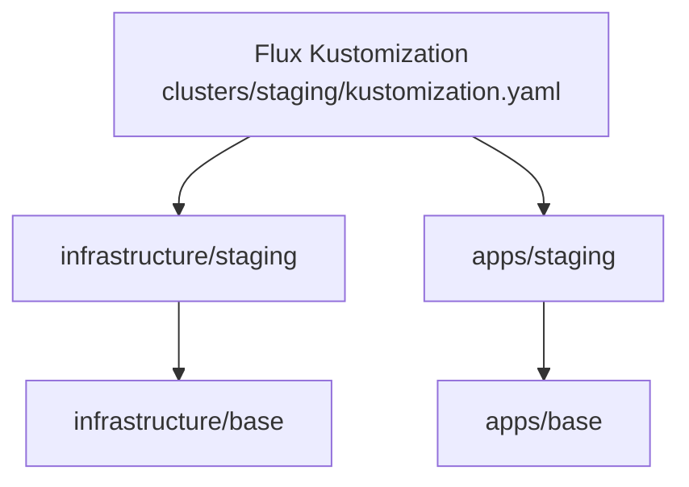

# elitedesk GitOps K3s Cluster

This repository contains a fully automated, GitOps-driven Kubernetes setup using [k3s](https://k3s.io/), [Flux](https://fluxcd.io), and [Ansible](https://www.ansible.com/).  
It is designed to bootstrap, configure, and manage a self-hosted K3s cluster via GitHub and FluxCD.

## 🎯 Project Goals

- Fully declarative infrastructure and application deployment
- Git as the single source of truth
- Automated cluster bootstrap with Ansible
- Environment separation (staging & production)
- No sensitive data in Git

---

## 🧱 Project Structure

```
.
├── bootstrap/                  # Initial provisioning scripts (Ansible)
│   └── ansible/
├── clusters/                  # Flux entrypoints per environment
│   ├── production/
│   └── staging/
├── infrastructure/           # Cluster infrastructure definitions (NFS, ingress, etc.)
│   ├── base/
│   ├── production/
│   └── staging/
└── apps/                     # Application layer
    ├── base/
    ├── production/
    └── staging/
```

---

## 🔁 Flux Sync Flow



### How it works:

1. `flux bootstrap` points to `clusters/staging/` (or `production/`)
2. The file `clusters/staging/kustomization.yaml` uses Kustomize to include:
   - `../../infrastructure/staging`
   - `../../apps/staging`
3. Inside `infrastructure/staging` and `apps/staging` live your **Flux Kustomization objects**
4. These objects define actual resources and overlays per environment
5. Base resources are reused via `infrastructure/base` and `apps/base`

---

## 🚀 Getting Started

1. Use Ansible to provision the server:

```bash
cd bootstrap/ansible
ansible-playbook -i inventory.ini playbook.yaml --ask-become-pass
```

2. Export your kubeconfig:

```bash
export KUBECONFIG=~/.kube/elitedesk-k3s.yaml
```

3. Bootstrap Flux:

```bash
flux bootstrap github   --owner=rokoter   --repository=elitedesk   --branch=main   --path=clusters/staging   --personal
```

---

## 🧪 Environments

The `staging` and `production` folders let you deploy resources separately to multiple environments.  
Each environment has its own:
- `kustomization.yaml`
- overlays for infra & apps
- secrets, ingress, and domain config

---

## 📦 NFS Storage (Helm via Flux)

An NFS dynamic provisioner is installed using Helm, managed through Flux in `infrastructure/`.  
Directory structure:

```
infrastructure/
  ├── base/nfs/
  │   ├── helmrelease.yaml
  │   └── helmrepository.yaml
  └── staging/nfs/
      └── kustomization.yaml
```

To disable a test PVC without removing config:

```bash
kubectl delete pvc test-nfs -n default
```

---

## 📌 Requirements

- Ubuntu 24.04 LTS server
- GitHub account & personal access token
- SSH access with passwordless sudo
- Domain for ingress (with DNS API access for ACME)

---

## ✅ Status

- [x] Ansible provisioning
- [x] Flux bootstrapped via GitHub
- [x] NFS dynamic provisioner (Helm via Flux)
- [ ] Traefik + ACME DNS challenge (TransIP)
- [ ] Demo app (e.g. Nextcloud)
